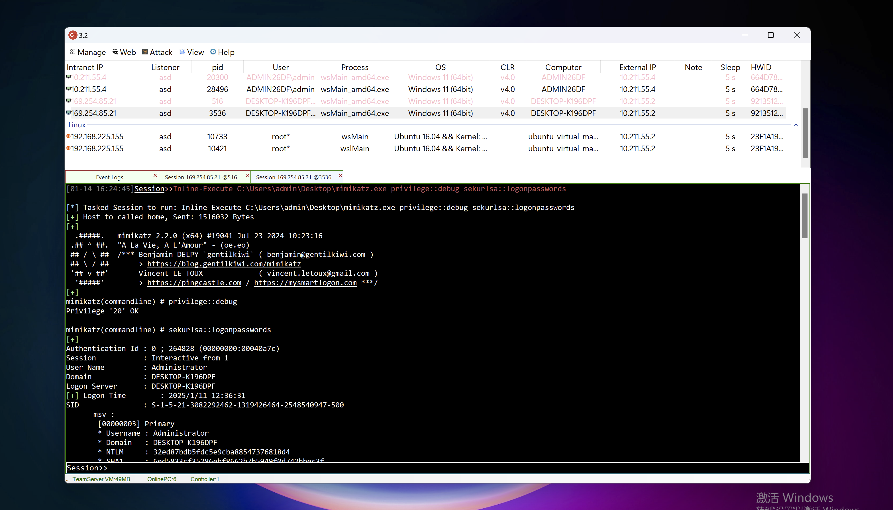
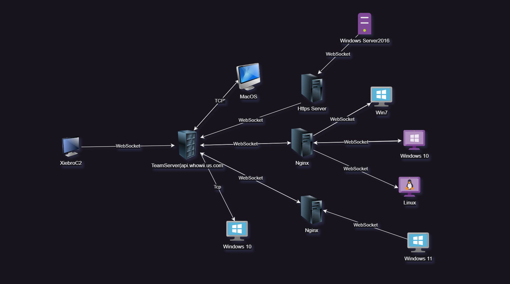

    
    
    
    

## Main Features

- **Implant**: Written in Golang, compatible with Windows, Linux, and MacOS (support for mobile platforms under consideration for future updates).
- **Teamserver**: Built with .NET 6.0, does not require the .NET Core runtime environment.
- **Controller**: Supports reverse shell, file management, process management, network traffic monitoring, memory loading, reverse proxy (based on the [IOX](https://github.com/EddieIvan01/iox) model), screenshots, process injection and migration, AV/EDR detection, inline PowerShell commands.
- **Memory Operations**: Supports loading PE files into memory on Windows/Linux, process injection and migration, allowing file-free execution.
- **.NET Assemblies**: Execute .NET assemblies in memory (execute-assembly, inline-assembly).
- **Lua Scripting**: Extend command centers and menus through Lua scripts (similar to CNA scripts).
- **Custom RDI Shellcode**: (64-bit only, 32-bit requires manual client compilation) or generate shellcode using [donut](https://github.com/TheWover/donut) or [Godonut](https://github.com/Binject/go-donut).
- **Telegram Integration**: Set up Telegram notifications for host check-ins by modifying the `profile.json` parameters for Chat ID and API Token.

## Supported Platforms

**Implant (Session)**

- **Windows**: Windows 7–11, Windows Server 2008–2022
- **Linux**: Supports glibc 2.17+ (e.g., Ubuntu, Debian, CentOS)
- **MacOS**: macOS 10.15+

The project is compiled using Go 1.20 for compatibility. Note that Go 1.20+ does not support Windows 7, Windows Server 2008, and some older Linux systems. The payload in XiebroC2 only supports x64 architecture. For older systems, you must compile the source code with Go versions 1.19–1.16.

**Teamserver**

- **Windows**: Windows 8–11, Windows Server 2012–2022
- **Linux**: Supports glibc 2.17+ systems.

## Screenshots

Topology Structure

Command List

Memory Loading Mimikatz

File Management

Reverse Proxy

## How to Use

- Download binaries directly from: [Release](https://github.com/INotGreen/XiebroC2/releases)
- Usage Guide: [XiebroC2 Wiki](https://github.com/INotGreen/XiebroC2/wiki)
- Extend penetration testing tools into Lua plugins: [Xiebro-Plugins](https://github.com/INotGreen/Xiebro-Plugins)

## Network Topology

View network traffic distribution with a visual topology diagram.

## Video Demo

[Watch the XiebroC2 Demo on YouTube](https://www.youtube.com/watch?v=iZpltGdu4Y4)

## TODO

- Develop payloads for PowerShell, VBScript, HTA, JScript, etc.
- Open more forms and API interfaces to facilitate Lua plugin development.

## Star History

## Disclaimer

This project is intended solely for educational and research purposes in penetration testing practice. It is currently in a testing phase. It is strictly prohibited to use this tool for any illegal activities, including black market operations or unauthorized penetration attempts. The internet is not a lawless space! By using this tool, you agree to comply with these terms.

To prevent misuse by malicious actors, the most harmful features have been removed, leaving only basic functions for penetration testing demonstrations. The **Teamserver** and **Controller** components are not open-source.
